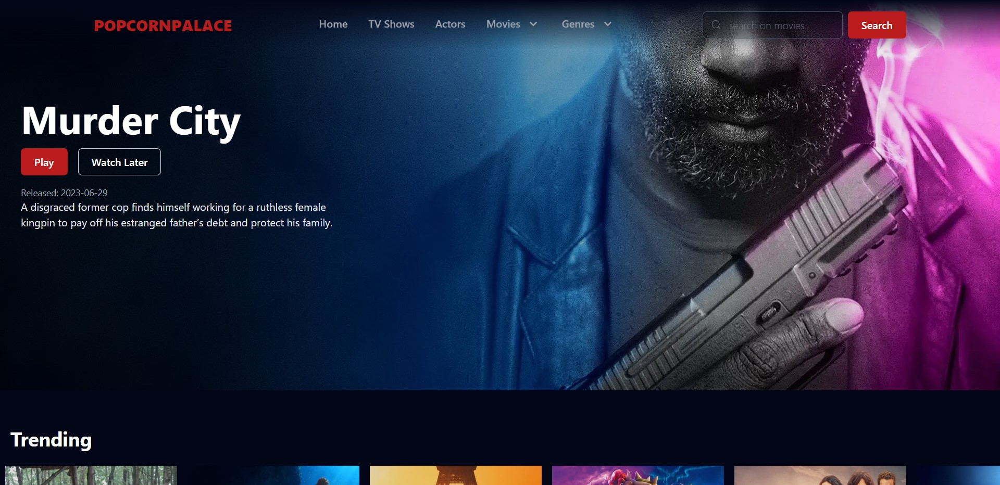
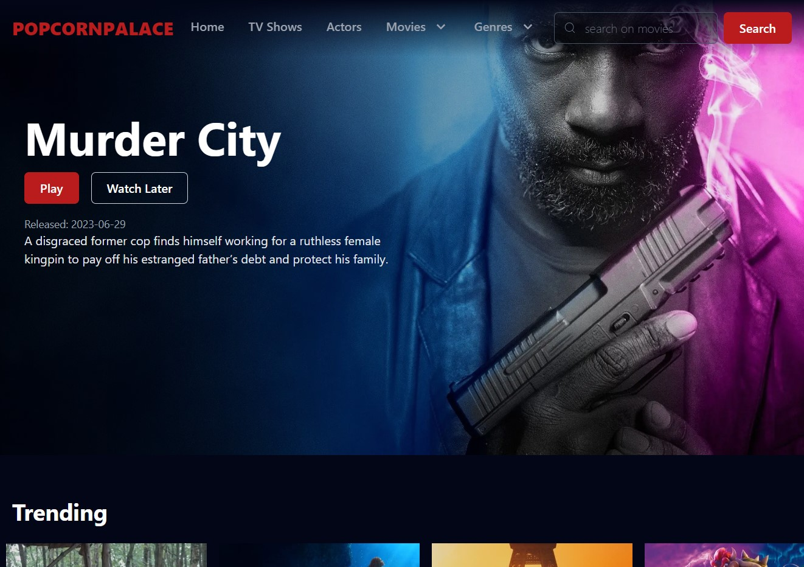
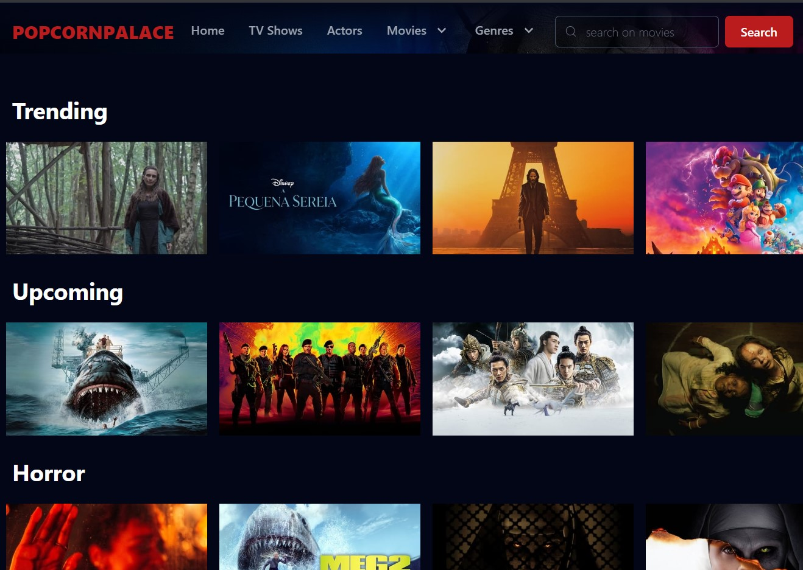
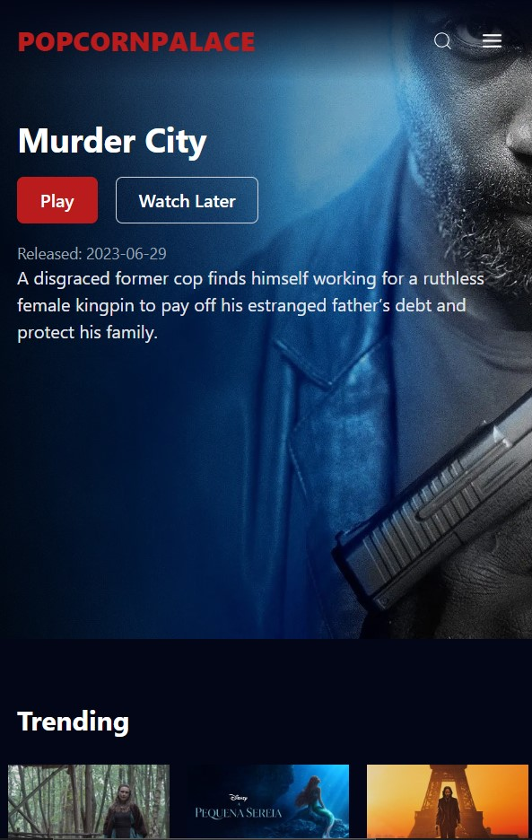
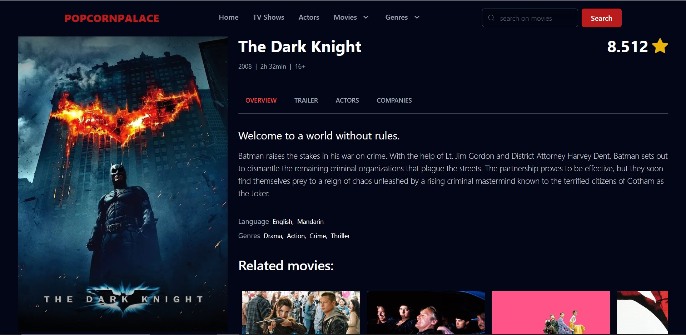
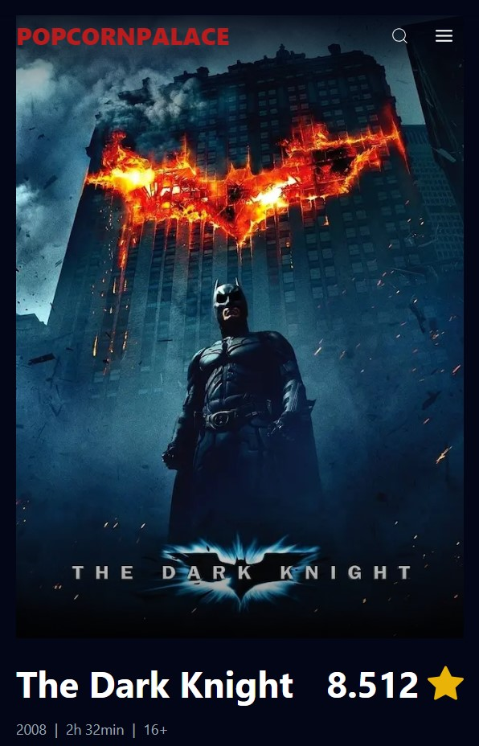
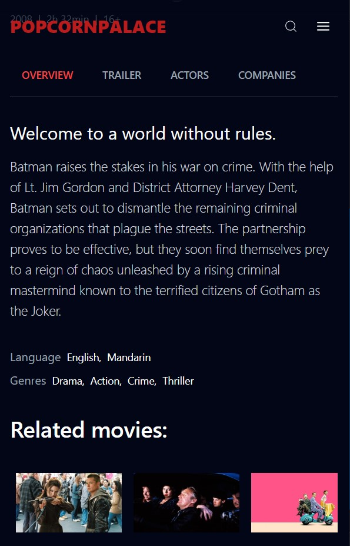

## POPCORN PALACE

This is a movie and TV show catalog app built with Next.js, React Icons, React YouTube, and Tailwind CSS.

The app has the following features:

- A home page with a cover that displays a random movie each time the user visits the page.
- A movies page where users can browse movies by genre or category, or search for movies by title.
- A TV shows page where users can browse TV shows by genre or category, or search for TV shows by title.
- An actor details page where users can see more information about an actor, including their filmography.
- A movie details page where users can see more information about a movie, including its trailer, cast, and crew.
- A TV show details page where users can see more information about a TV show, including its trailer, cast, and crew.

The app is styled with Tailwind CSS, which makes it easy to create a custom look and feel for the app.

## Team Members

1. Riadh MOUAMNIA | [linkedin](https://www.linkedin.com/in/riadh-mouamnia)
2. Mohamed MATASSI | [linkedin](https://www.linkedin.com/in/matassi-mohamed)
3. Meriem MANSOURI | [linkedin](https://www.linkedin.com/in/meriem-mansouri-1b1643276)
4. Mohamed TCHOKETCH | [linkedin](https://www.linkedin.com/in)
5. Abdel Hakim TIABI | [linkedin](https://www.linkedin.com/in)

## Screenshots

Home page desktop:

## 

Home page desktop smaller screen:

## 

Home page desktop smaller screen 2:

## 

Home page mobile:

## 

Movie details page desktop:

## 

Movie details page mobile 1:

## 

Movie details page mobile 2:

---
